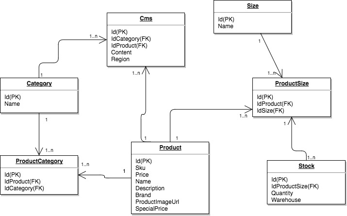

# Storage solutions

## Primeira opção
- Banco de dados NoSQL, chave valor,
- Exemplo: Redis
- Alta performace para consulta
- Facil suporte a cluster
- Não garantes os dados com ACID, uma alternativa seria usar o Infinispan

## Segunda opção
- Banco de dados NoSQL, Documento,
- Exemplo: MongoDb
- Facil suporte a cluster
- Recomendado utilizar quando o modelo de dados se adequa a proposta de banco orientado a Documentos
- Exemplo:
```json
{
	"product": {
		"sku": "SPD-99",
		"price": 1992.99,
		"name": "Spiderman Suit",
		"description": "Fancy suit for Spidermen",
		"size": [{
			"name": "34",
			"stocks": [{
				"quantity": 10,
				"warehouse": "centro"
			}]
		}, {
			"name": "35",
			"stocks": [{
				"quantity": 10,
				"warehouse": "raposo tavares"
			}]
		}],
		"brand": "Peter Parker",
		"categories": ["Super Heroes", "Spiderman", "Clothes"],
		"product_image_url": "http://cdn.gfg.com.br/spider-suite.jpg",
		"special_price": 1800.00
	},
	"cms": [{
		"content": "Teste conteudo CMS",
		"region": "sudeste"
	}]
}
```

## Terceira opção
- Banco de dados SQL, Relacional,
- Exemplo: MySQL, PostgreSQL
- Suporte a cluster
- Grande suporte ACID
- Recomendado utilizar quando o modelo de dados se adequa a proposta de banco de dados relacional,



*As opções podem ser combinadas entre si para o melhor aproveitamento onde cada uma tem um resultado melhor*